# CursusPython 2025 - Avond 3 - MicroPython

  * [Microcontrollers](#microcontrollers)
  * [Python vs MicroPython](#python-vs-micropython)
  * [Interpreter](#interpreter)
  * [Thonny en de micro:bit](#thonny-en-de-micro-bit)
  * [Niet vergeten: Opslaan](#niet-vergeten--opslaan)
## Microcontrollers

Een microcontroller is een compacte schakeling met een processor, geheugen en I/O (Input/Output), gebruikt voor het aansturen van sensoren en motoren.

Relevante microcontrollers:

- RPi Pico: Gebruikt de RP2040, een dual-core ARM Cortex-M0+.
- ESP32: Van Espressif, met WiFi en Bluetooth, ideaal voor IoT (Internet of Things).
- micro:bit: Met Nordic nRF52833 of nRF51822, inclusief Bluetooth en sensoren.

Microcontrollers worden veel gebruikt in elektronica, IoT en educatie.

|**Raspberry Pi Pico**|**ESP32**|**Micro:bit**|
|----------|----------|----------|
| 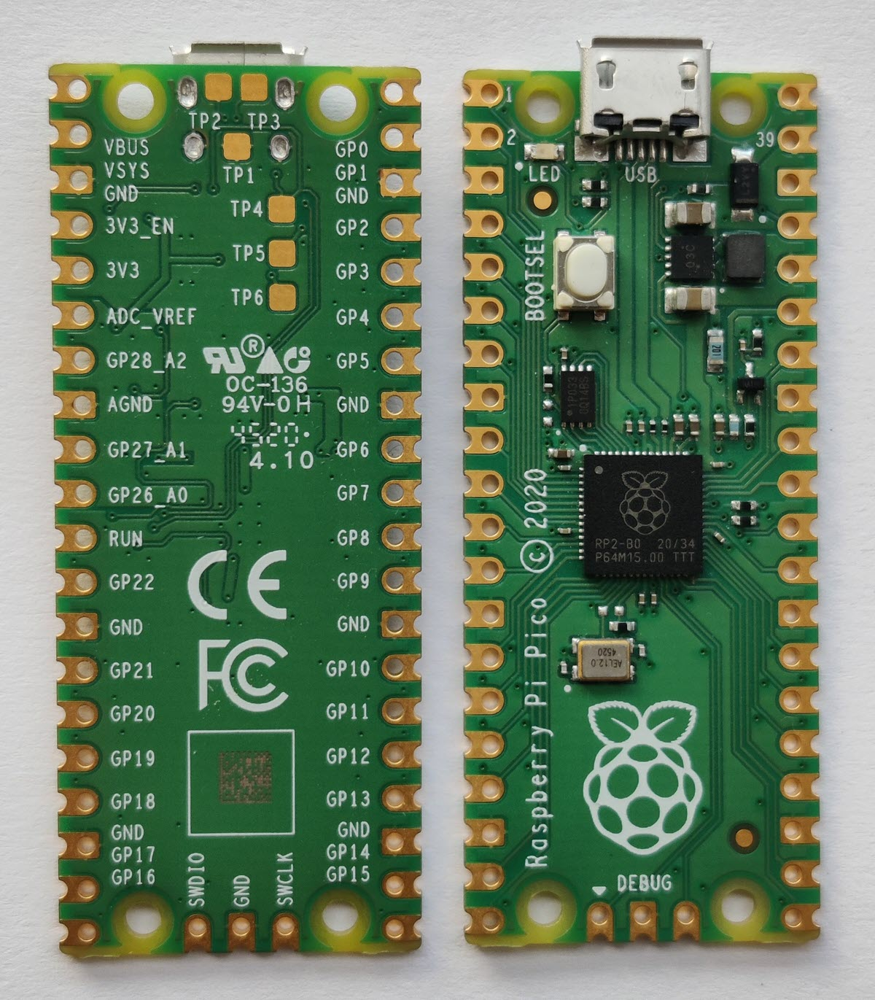 | 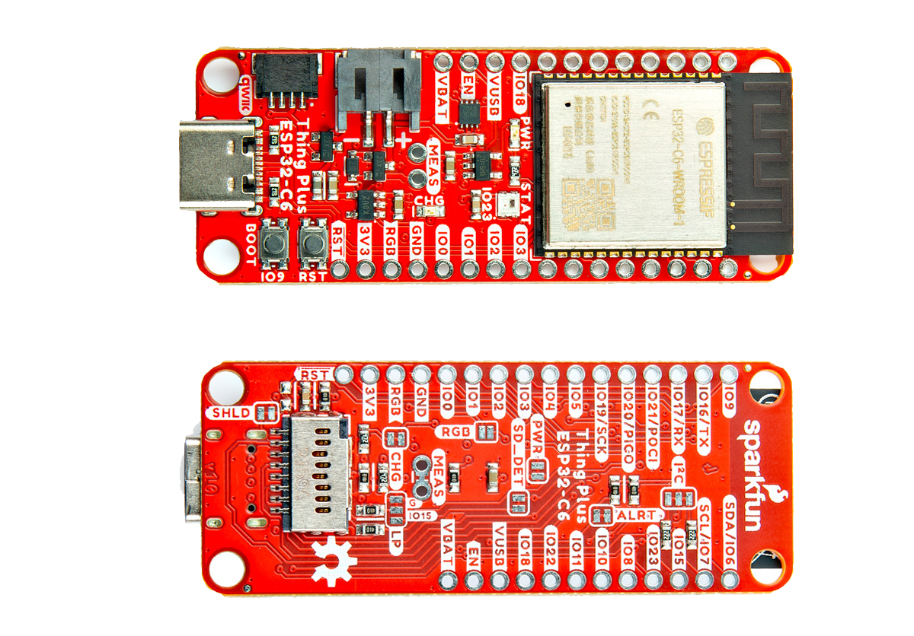 | 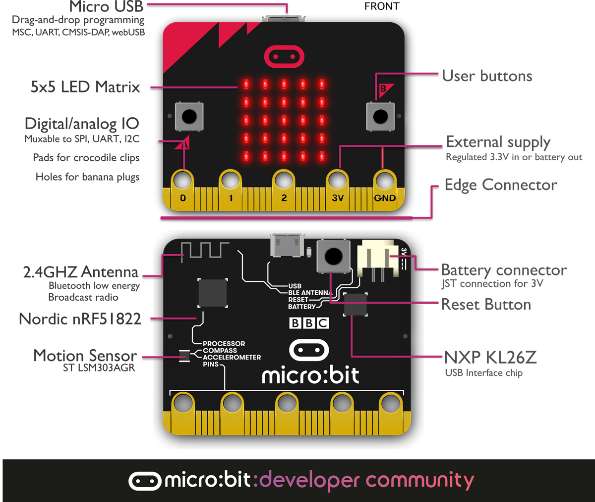           |
|Dit is de eenvoudigste uitvoering. Er zijn ook nieuwere uitvoeringen met o.a. WiFi.|Dit is maar één voorbeeld, er bestaan vele uitvoeren van ESP32's.|Dit is V1-uitvoering (de originele), inmiddels is er ook een V2-uitvoering met een luidspreker, microfoon en meer geheugen.|

## Python vs MicroPython
|**Kenmerk**               |**Python**                      |**MicroPython**                   |
|:-------------------------|:-------------------------------|:------------------------------------|
| **Doelgroep**            | Algemeen gebruik op computers  | Microcontrollers (zoals micro:bit, ESP32) |
| **Taalversie**           | Gebaseerd op Python 3          | Afgeslankte versie van Python 3  |
| **Interpreter**          | CPython (standaard)            | MicroPython interpreter          |
| **Modules**              | Grote standaardbibliotheek     | Kleinere, geoptimaliseerde bibliotheek |
| **Besturingssysteem nodig?** | Ja (Windows, macOS, Linux)   | Nee, draait direct op de microcontroller |
| **Geheugengebruik**      | Vereist veel RAM en opslag     | Geoptimaliseerd voor weinig geheugen |
| **Prestaties**           | Sneller dankzij JIT-compilatie | Langzamer vanwege beperkte hardware |
| **I/O-mogelijkheden**    | Bestanden, netwerken, databases | Directe controle over hardware (GPIO, I2C, SPI, etc.) |
| **Stroomverbruik**       | Geen beperkingen              | Laag energieverbruik voor embedded systemen |

## Interpreter
De *MicroPython interpreter* is een programma dat MicroPython-code direct uitvoert op een microcontroller, zoals de BBC micro:bit, ESP32 of Raspberry Pi Pico.

MicroPython is speciaal ontworpen voor kleine, embedded systemen met beperkte rekenkracht en geheugen. In tegenstelling tot het gewone Python, draait het zonder besturingssysteem en werkt het direct met de hardware.

**Waar bevindt de MicroPython interpreter zich?**

De MicroPython Interpreter bevindt zich op de microcontroller zelf. Dit betekent:
  - Opgeslagen in het flashgeheugen van de microcontroller.
  - Start automatisch op wanneer de microcontroller wordt ingeschakeld.
  - Geen apart besturingssysteem nodig, het draait direct op de hardware.

Wanneer je een script naar de microcontroller uploadt (via Thonny, Mu Editor of een seriële verbinding), wordt het door de interne MicroPython interpreter uitgevoerd.

**Hoe werkt de MicroPython interpreter?**

- Je schrijft code in een editor zoals Thonny of Mu Editor.
- De code wordt als tekstbestand (met de extensie *'.py.'* geüpload naar de microcontroller.
- De MicroPython interpreter op de microcontroller voert de code direct uit.
- Bij een herstart blijft het programma draaien, zolang het in het bestand als main.py is opgeslagen op de microcontroller.
- Wil je live testen? Je kunt de REPL (Read-Eval-Print Loop) gebruiken, waarmee je direct opdrachten aan de MicroPython interpreter geeft via een seriële verbinding.

**Hoe komt de MicroPython interpreter op de microcontroller?**

Dat hangt af van de programmeeromgeving die je gebruikt. Dit zijn de meest bekende omgevingen:

- Mu-editor (https://codewith.mu/)
- Python.microbit.org (https://python.microbit.org/v/3)
- MakeCode (https://makecode.microbit.org/)
- Thonny (https://thonny.org/)

In deze cursus hebben we tot nu toe gewerkt met Thonny en hier gaan we nu ook mee door.

- **Thonny** zal de interpreter bij de eerste keer dat je een programma op de microcontroller wilt uitvoeren direct proberen te uploaden. Als dit niet lukt dan kan je de interpreter zelf vanuit Thonny in het flashgeheugen van de microcontroller zetten. We komen hier nog op terug.
- Bij **andere programmeeromgevingen** moet je de interpreter handmatig installeren.
  
**Kan ik de MicroPython interpreter ook weer verwijderen?**

De MicroPython interpreter wordt opgeslagen in het flash-geheugen van de microcontroller. Dit betekent dat het 'bestand' van buitenaf niet zichtbaar/toegangelijk is (zie verderop de beschrijving van het Thonny-venster *Files*). Op de micro:bit kan je de interpreter verwijderen door in de programeeromgeving https://makecode.microbit.org/ een programma te schrijven en dit vanuit die omgeving te uploaden naar de micro:bit. Je kan ook een hex-bestand dat gemaakt is in MakeCode via de Windows verkenner kopiëren naar de micri:bit. Dit overschrijft alles wat eerder met Thonny op de micro:bit is gezet.

## Thonny en de micro:bit

We hebben het hiervoor al even gehad over Thonny en de micro:bit. We kijken eerst nog even naar de belangrijkste vensters in Thonny, we gaan een micro:bit aansluiten, de interpreter installeren en ons eerste MicroPython-programma op de micro:bit zetten.

**Welke Thonny-vensters waren ook al weer belangrijk?**
|Venster|Waarvoor?|
|:-----|:-----|
|**Editor** |Hierin schrijven we onze programma's. Zolang het programma in de editor staat is het een gewoon tekstbestand dat we ook hadden schrijven in bijvoorbeeld het kladblok van Windows of in Word. Om aan te geven dat het een Pythonprogramma is krijgt het bestand de extensie *'.py'*.|
|**Shell**  |Het deel van Thonny dat de uitvoer van je code laat zien en waar je ook direct opdrachten kan invoeren. De Shell in Thonny fungeert als een REPL, wat betekent dat je hier direct Python-commando’s kunt invoeren en meteen de uitvoer kunt zien. <br>**REPL (Read-Evaluate-Print-Loop):** Een interactieve omgeving waarin je Python-commando’s in real-time kunt uitvoeren. Thonny bevat een ingebouwde REPL, toegankelijk via de Shell, waarmee je direct commando’s naar de micro:bit kunt sturen en de uitvoer meteen kunt zien. De REPL maakt gebruik van de interpreter om elk commando direct te evalueren en het resultaat ervan in de Shell te tonen. Dit maakt het mogelijk om snel te experimenteren met kleine stukjes code, in tegenstelling tot de editor, waar je complete programma’s schrijft die pas na uitvoering worden getest.|
|**Files**  |Bij de eerdere Pythonlessen was de eigen 'verkenner' van Thonny nog niet zo belangrijk, maar bij microcontrollers als de Raspberry Pi Pico en de micro:bit kan je de programmacode ook op de controller zelf opslaan. Met de Verkenner van Windows zijn deze echter niet zichtbaar.|

In Thonny kan je via het menu *View* vensters zichtbaar maken:

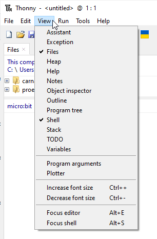

**Micro:bit (of een andere microcontroller) aansluiten**

Op deze micro:bit is geen MicroPython interpreter geïnstalleerd. 

1. Start Thonny

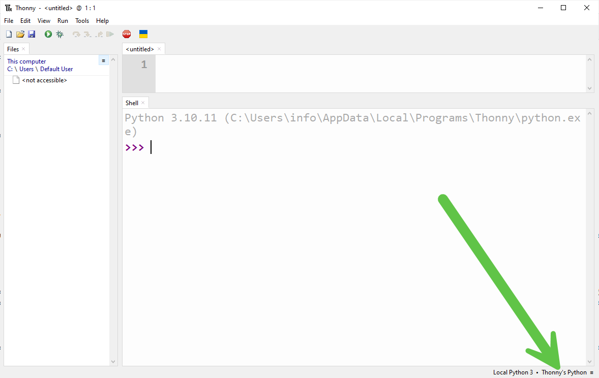

Onderin het scherm zie je dat Thonny nog is ingesteld op de 'gewone'versie van Python waarmee we in de twee eerste lessen hebben gewerkt.

2. Sluit de micro:bit aan

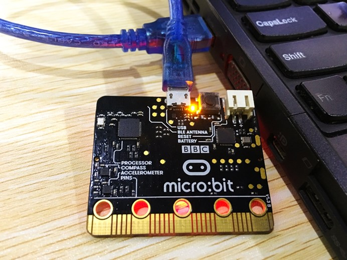

*Bron: https://www.elecfreaks.com/blog/post/start-your-microbit-programming-trip.html*

Gebruik hiervoor een micro-USB-kabel. Bij de micro:bit wordt een kort USB-kabeltje geleverd, waarschijnlijk werkt het handiger met een langere kabel.

- Op de micro:bit zit ook een aansluiting voor een batterij. Het is geen probleem om de batterij tegelijk met de USB-kabel te gebruiken.

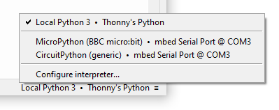

Klik onderin het scherm. Je ziet dat de micro:bit al wordt herkend en in dit geval gebruik maakt van de poort *COM3*.

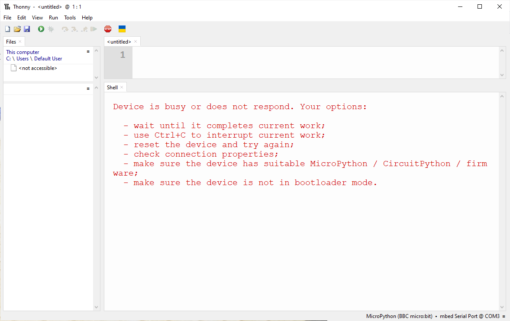

In het editor-venster wordt aangegeven dat er iets niet in orde is. Dat gaan we nu oplossen!

3. MicroPython interpreter installeren

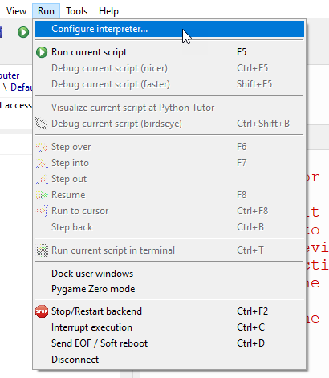

Kies in het menu *Run > Configure interpreter...*

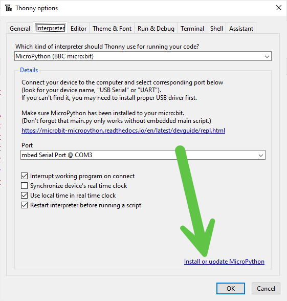

Klik op *Install or update MicroPython*

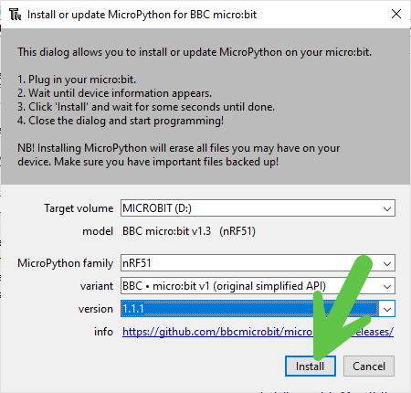

- Dit voorbeeld gaat over micro:bit V1, deze gebruikt de processor **nRF51**. Een micro:bit V2 heeft een nRF52 aan boord.
- We gaan werken met de aanbevolen variant van de MicroPython interpreter: **BBC micro:bit V1 (original simplified API)**
- En met de nieuwste versie: **1.1.1**

Als je dit hebt ingesteld klik je op de knop *Install* en sluit je de twee pop-ups.

4. Het eerste MicroPython-programma voor de micro🫦

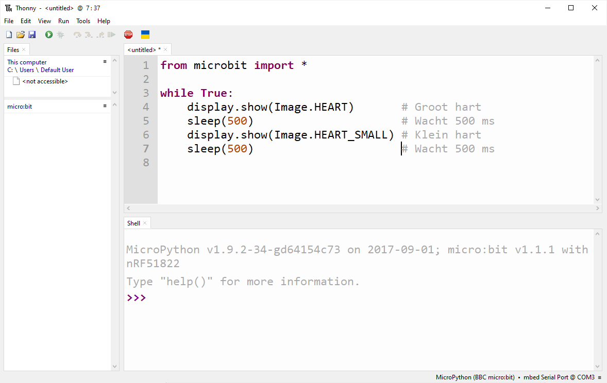

Schrijf (of kopieer) het programma in de editor.

```python
from microbit import *

while True:
    display.show(Image.HEART)
    sleep(500)
    display.show(Image.HEART_SMALL)
    sleep(500)
```

Klik op de groene knop   of druk op de toets [F5].

## Niet vergeten: Opslaan

Kies in het menu *File > Save as...*

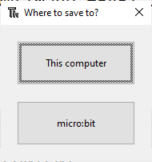

Je hebt de keuze om het programma op te slaan **op jouw computer** of **op de micro:bit** zelf. Als je wilt dat jouw programma het ook doet als de micro:bit niet is aangesloten op Thonny, geef het dan de naam ***main.py*** en sla het op op de micro:bit. Als het programma op de micro:bit nog loopt moet je in Thonny eerst op de stopknop   klikken.

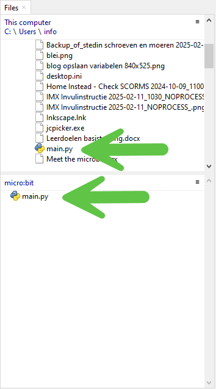

Het programma is opgeslagen op de computer **en** op de micro:bit zelf.

## De microbitbibliotheek

De eerste regel van het programma is:
```python
from microbit import *
```
Deze bibliotheek bevindt zich op de micro:bit en is onderdeel van de firmware van de micro:bit.

- De **firmware** op de micro:bit kan je vergelijken met de BIOS van een computer en regelt alle basisdingen op de micro:bit. Meer over het (updaten van) de firmware staat op https://microbit.org/get-started/user-guide/firmware/.

## Functies in de MicroPython `microbit`-bibliotheek

| **Categorie**              | **Functie** | **Alleen micro:bit V2** |
|----------------------------|------------|-------------------------|
| **Algemeen**               | `sleep(ms)`, `running_time()`, `reset()`, `temperature()` | `power.off()` |
| **Display (`display`)**    | `display.show(image)`, `display.scroll(text, delay, wait, loop, monospace)`, `display.clear()`, `display.on()`, `display.off()`, `display.get_pixel(x, y)`, `display.set_pixel(x, y, brightness)` |  |
| **Knoppen (`button_a`, `button_b`)** | `button_a.is_pressed()`, `button_b.is_pressed()`, `button_a.was_pressed()`, `button_b.was_pressed()`, `button_a.get_presses()`, `button_b.get_presses()` |  |
| **Afbeeldingen (`Image`)** | `Image.HEART`, `Image.HAPPY`, `Image.SAD`, `Image.SMILE`, `Image.SURPRISED`, `Image.ANGRY`, `Image.ALL_CLOCKS`, `Image.ALL_ARROWS`, `Image(width, height, pixels)`, `Image.invert()`, `Image.shift_left(n)`, `Image.shift_right(n)`, `Image.shift_up(n)`, `Image.shift_down(n)`, `Image.copy()` |  |
| **Pinnen (`pin0` - `pin16`)** | `pinX.read_digital()`, `pinX.write_digital(value)`, `pinX.read_analog()`, `pinX.write_analog(value)`, `pinX.set_pull(mode)`, `pinX.is_touched()` | `pinX.audio.play_tone(frequency, duration)`, `pinX.audio.stop()` |
| **Kompas (`compass`)**     | `compass.calibrate()`, `compass.heading()`, `compass.get_x()`, `compass.get_y()`, `compass.get_z()`, `compass.is_calibrated()`, `compass.clear_calibration()` |  |
| **Versnellingsmeter (`accelerometer`)** | `accelerometer.get_x()`, `accelerometer.get_y()`, `accelerometer.get_z()`, `accelerometer.current_gesture()`, `accelerometer.is_gesture(name)`, `accelerometer.was_gesture(name)`, `accelerometer.get_gestures()` |  |
| **Muziek (`music`)**       | `music.play(melody, pin, wait, loop)`, `music.pitch(frequency, duration, pin)`, `music.stop()`, `music.reset()`, `music.set_tempo(ticks, bpm)`, `music.get_tempo()`, `music.DADADADUM`, `music.ENTERTAINER`, `music.PRELUDE`, `music.ODE`, `music.NYAN`, `music.RINGTONE`, `music.FUNK`, `music.BLUES`, `music.BIRTHDAY`, `music.WEDDING`, `music.FUNERAL`, `music.PUNCHLINE`, `music.PYTHON`, `music.BADDY`, `music.CHASE`, `music.BA_DING`, `music.WAWAWAWAA`, `music.JUMP_UP`, `music.JUMP_DOWN`, `music.POWER_UP`, `music.POWER_DOWN` | `music.set_speaker_enabled(state)`, `music.is_speaker_enabled()` |
| **Radio (`radio`)**        | `radio.on()`, `radio.off()`, `radio.send(message)`, `radio.receive()`, `radio.config(channel, power, queue, data_rate, length, group)` |  |
| **Luidspreker (`audio`)**  |  | `audio.play(source, pin, wait, loop)`, `audio.stop()`, `audio.is_playing()` |
| **Touch-sensor (`touch`)** |  | `touch.pinX.is_touched()` |

Als je meer wilt weten over al deze functies dan vind je die op https://microbit-micropython.readthedocs.io/

Je hoeft de URL niet uit je hoofd te leren! Als je in de Shell van Thonny 'help()' invoert dan krijg je in de shelle een paar handige links te zien:

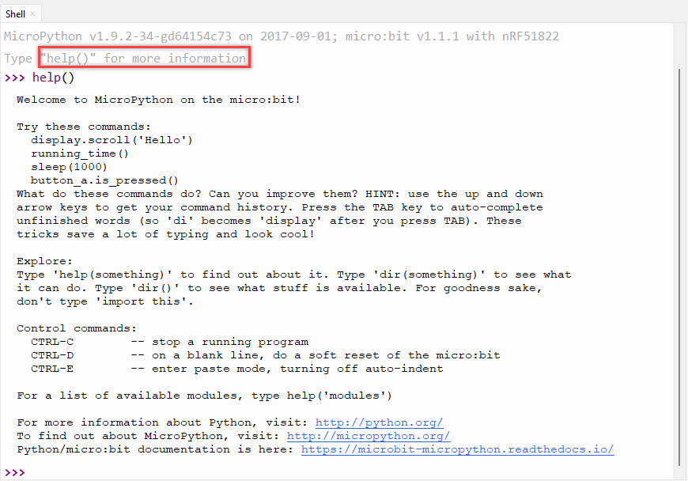

## Basisbegrippen in MicroPython (`microbit`)

| **Begrip**     | **Wat is het?** | **Voorbeeld in MicroPython** |
|--------------|---------------|------------------------|
| **Object**   | Een instantie van een klasse | `display`, `compass`, `accelerometer` |
| **Klasse**   | Een blauwdruk voor objecten | `Image` |
| **Instantie** | Een specifiek object gemaakt van een klasse | `Image.HEART`, `pin0` |
| **Methode**  | Een functie die bij een object hoort | `display.show()`, `accelerometer.get_x()` |
| **Eigenschap** | Een waarde binnen een object | `compass.heading`, `pin0.is_touched` |
| **Functie**  | Een zelfstandige blok code | `sleep(1000)`, `print("Hallo")` |
| **Attribuut** | Een variabele in een object | `accelerometer.get_x()`, `pin0.read_analog()` |
| **Module**   | Een Python-bestand met functies en klassen | `microbit`, `servo`, `neopixel` |

